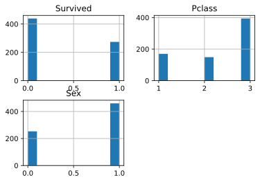

# mcs_kfold

`mcs_kfold` stands for "monte carlo stratified k fold". This library attempts to achieve equal distribution of discrete/categorical variables in all folds.
Internally, the seed is changed and stratified k-fold trials are repeated to find the seed with the least entropy in the distribution of the specified variables. The greatest advantage of this method is that it can be applied to multi-dimensional targets.

## Usage

```python
from mcs_kfold import MCSKFold
mcskf = MCSKFold(n_splits=num_cv, shuffle_mc=True, max_iter=100)

for fold, (train_idx, valid_idx) in enumerate(
    mcskf.split(df=df, target_cols=["Survived", "Pclass", "Sex"])
):
    .
    .
    .


```

see also [example](https://github.com/MasashiSode/mcs_kfold/blob/master/examples/exp_titanic.ipynb) for further information.

histograms shown below is generated with this library with [Kaggle Titanic: Machine Learning from Disaster data](https://www.kaggle.com/c/titanic/data?select=train.csv). you can see here that three target variables are equally distributed over five folds.

#### fold 0


#### fold 1


#### fold 2


#### fold 3



#### fold 4


## Install

### pip

`pip install mcs_kfold`

### Install newest version

```sh
git clone https://github.com/MasashiSode/mcs_kfold
cd mcs_kfold
pip install .
```

## Develop

```sh
poetry install
```

## Test

```sh
pytest
```
